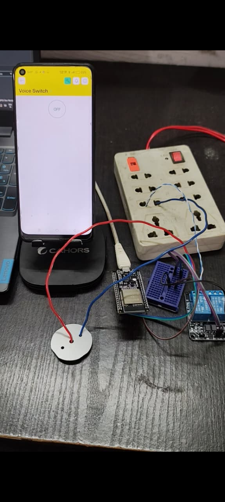

# Smart-Home-Automation-ESP32-Blynk
An IoT-based Smart Home Automation System using ESP32, Relay Module, and Blynk app to control AC appliances.
# Smart Home Automation using ESP32 & Blynk  

This project demonstrates a simple **IoT-based Home Automation System** using an **ESP32 microcontroller** and a **Relay Module**.  
The appliances can be controlled via the **Blynk mobile app**, making it a beginner-friendly yet practical project for smart homes.  

---

## 🚀 Features
- Control AC appliances remotely using the Blynk app  
- Uses ESP32 Wi-Fi module for IoT connectivity  
- Relay module to switch AC appliances safely  
- Real-time control and monitoring  

---

## 📂 Files in this Repository
- `HomeAutomation.ino` → Arduino source code for ESP32  
- `circuit_diagram.jpg` → Circuit connection diagram  
- `home automation project.mp4` → Demo video of the working project  

---

## ⚡ Circuit Overview
  

---

## 📱 Demo
🎥 Watch the working project here:  
[▶️ Demo Video](home%20automation%20project.mp4)  

---

## 🛠️ Components Used
- ESP32 Development Board  
- 2-Channel Relay Module  
- Jumper Wires & Breadboard  
- AC Appliances (bulb/fan for demo)  
- Blynk Mobile App  

---

## 🔧 How to Use
1. Upload the `HomeAutomation.ino` code to your ESP32 using Arduino IDE.  
2. Connect the relay module and appliances as shown in the circuit diagram.  
3. Install the **Blynk app** on your mobile phone.  
4. Update your **Blynk Auth Token**, Wi-Fi SSID, and Password in the code.  
5. Run the project and control appliances from anywhere!  

---

## 📌 Project Applications
- Smart Home Appliance Control  
- IoT and Automation Learning Projects  
- Energy-Efficient Smart Homes  

---

## 👤 Author
Developed by Pranav som  
3rd Semester | Robotics & IoT Enthusiast  

---

